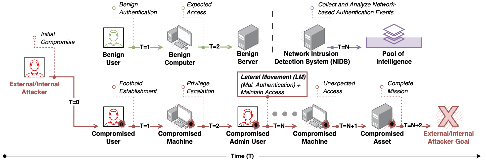
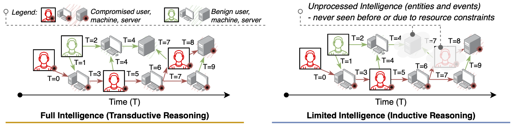

# Jbeil: Temporal Graph-Based Inductive Learning to Infer Lateral Movement in Evolving Enterprise Networks 

<a href="https://www.computer.org/csdl/proceedings-article/sp/2024/313000a009/1RjE9NF72De" target="_blank" class="button big">Click Here to Read Full Paper</a>

Accepted and Published at The 2024 IEEE Symposium on Security and Privacy (SP)

## Introduction
Jbeil is a data-driven framework to infer Lateral Movement (LM) attacks in evolving enterprise networks. Specifically, Jbeil takes as input time-stamped authentication events (benign events augmented with malicious ones) and output decision on LM activities within the network. The premise of this work is two folds: *(i)* lies in applying an encoder on a continuous-time evolving graph to produce for each time epoch the embedding of the visible graph nodes; and *(ii)* a decoder that leverage these embeddings to perform LM link prediction on unseen nodes using an inductive learning technique.

## Authors
[Joseph Khoury](https://scholar.google.com/citations?user=pupjXigAAAAJ&hl=en&oi=ao), Đorđe Klisura, Hadi Zanddizari, Gonzalo De La Torre Parra, Peyman Najafirad, Elias Bou-Harb.

## Dataset and Preprocessing
### Download the public data
Store the csv files in a folder named `data/`.
1. Access to the [Los Alamos National Laboratory (LANL) Dataset (auth.txt.gz)](https://csr.lanl.gov/data/cyber1/)
2. Access to the [Pivoting Dataset](https://ieeexplore.ieee.org/stamp/stamp.jsp?arnumber=8078189)

### Preprocess the data
The dense `npy` format is used to save features in binary format.

For LANL auth.txt.gz dataset:

    python utils/preprocess_data.py --data auth

For pivoting dataset:

    python utils/preprocess_data.py --data pivoting

## Network Graph Map and Graph Features
Check [Graph Features Extraction](https://github.com/LMscope/Jbeil/tree/main/Graph%20Features%20Extraction) folder.

## LM Detection Mechanism
Check [Jbeil](https://github.com/LMscope/Jbeil/tree/main/Jbeil) folder.

Usage:

    python train_self_supervised.py --data auth

## LM Augmentation Mechanism
Access to the **Hopper Lateral Movement Simulator** tool here: https://github.com/grantho/lateral-movement-simulator

Additional resources on the augmentation mechanism will be added soon...

## Acknowledgement
Our implementation adapts the code of [TGN](https://github.com/twitter-research/tgn) and [Hopper- LM Simulator](https://github.com/grantho/lateral-movement-simulator) as the code base and extensively adapts it to our purpose. We thank the authors for sharing their code.

## Cite us
    @inproceedings{khoury2023jbeil,
    title={Jbeil: Temporal Graph-Based Inductive Learning to Infer Lateral Movement in Evolving Enterprise Networks},
    author={Khoury, Joseph and Klisura, Dorde and Zanddizari, Hadi and Parra, Gonzalo De La Torre and Najafirad, Peyman and Bou-Harb, Elias},
    booktitle={2024 IEEE Symposium on Security and Privacy (SP)},
    pages={9--9},
    year={2023},
    organization={IEEE Computer Society}
    }
